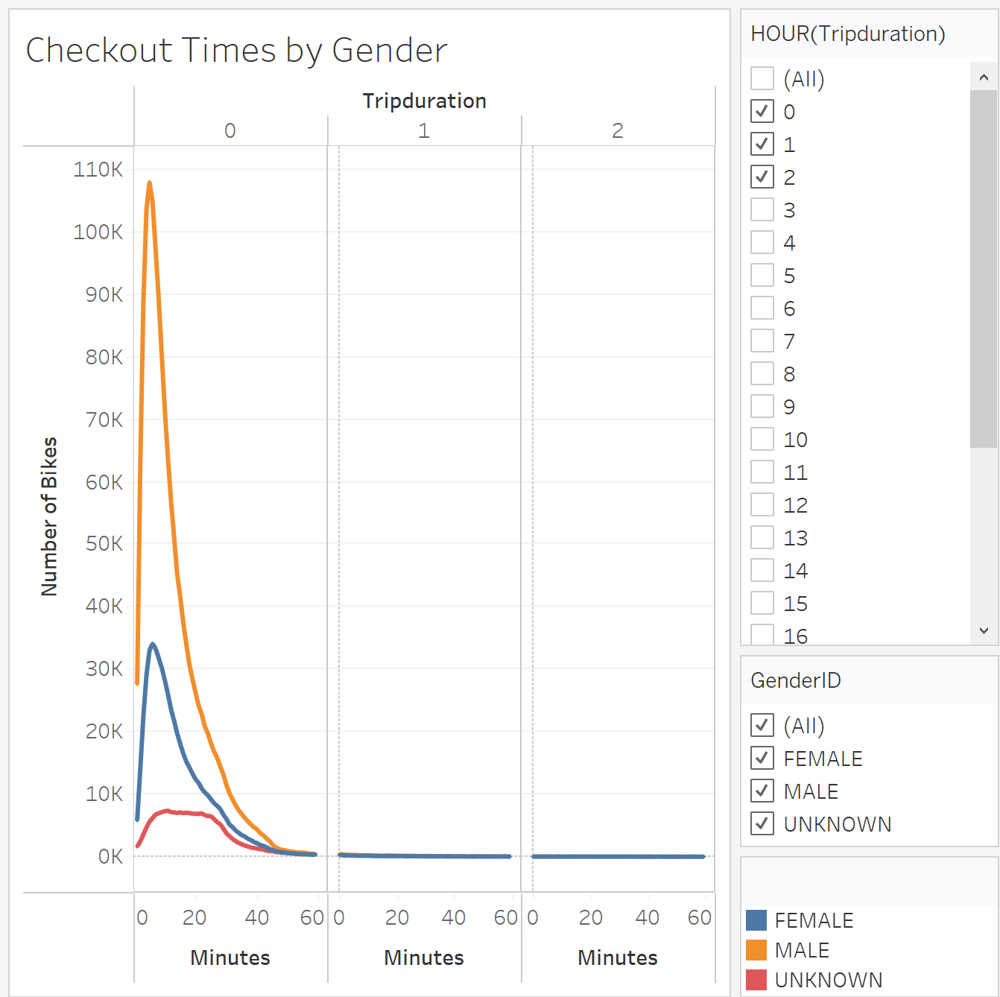
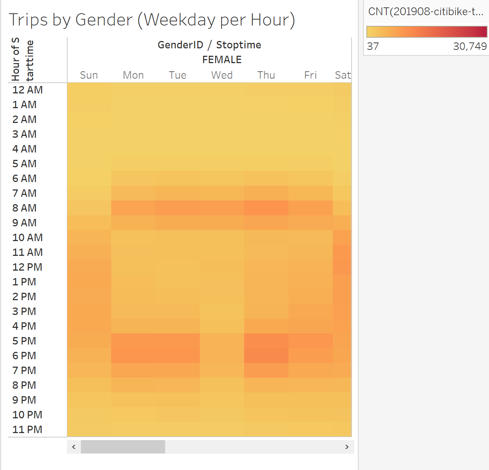

# bikesharing

# Module 14 Challenge NYC CitiBike - Tableau

# Overview of the Analysis

Evaluate the data for NYC Citi Bike, a bicycle ride-sharing service, for the month of August 
2019 to consider implementing a similar bike sharing system in the city of Des Moines. 
Evaluation using the month of August was chosen because there is likely more traffic 
during the summer months therefore more bike activity. The NYC City Bike dataset
contains approximately 2,344,244 trips for the month of August. Each trip includes statistical 
data tracking bikeid, trip duration, gender, start/stop times and start/stop locations, days 
of the week, gender and customer type. 

# Results
## Visualizations with Comments

Using dataset 201908-citibike-tripdata.csv provided charts/graphs as follows:

Chart shows the actual trip duration is generally short. The majority of trips is less than
twenty minutes.

The checkout times by gender clearly indicates males are the majority riders. With
female riders, as with males, the trips are less than twenty minutes. Possible cause
is using bikes to commute to/from work or neighborhood trips.

The heat map shows the most trips per Weekday per Hour is Thursday between 5-6 PM 
with Monday & Tuesday also having high ridership. Activity during the weekdays between 
12 PM and 7 PM can be attributed to rides for lunch, errands or after work for dinner, 
exercise or returning home. Morning riders between 7-9 AM can be commuters heading
 to work instead of driving or taking public transportation.

Regardless of the day of the week, MALE riders dominate the field!  The morning hours
 6 AM - 9 AM and evening hours 5 PM - 7-8 pm are definite commute times. Evening
 hours can account for working late, working off-shift hours, group sport activities 
or simply heading home.

Trips or rides can be broken down by the user type.  Customers are considered random
 riders whereas Subscribers are considered frequent riders where the preference is to 
pay a monthly or weekly fee and not have to pay for each ride. Being a subscriber provides
 incentive to ride more often no matter if it's for commuting to/from work or getting around
 town. It's obvious that males are more often subscribers!

The Gender Breakdown is based on the total number of trips/rides from the dataset. The pie chart isn't
very detailed but shows MALEs using Citi Bike the most. FEMALEs account for a quarter of the total rides 
but much less than MALEs.

During the summer months, the days are longer and people are outside more often. The bar chart 
reflects the busiest ride time to be at 5 PM (Hour 17). The entire day from 8 AM (Hour 8) until 7 PM
 (Hour 19) are the peak times, winding down at 9 PM (Hour 20). Evenings are most popular due
to cooler temperatures at the end of the day. Another consideration is that children are typically out 
of school and have more outdoor activities.

# Summary

With the dataset provided for August 2019, it appears that the most usage are by males who are
mostly subscribers. A reason for frequent users may benefit with lower cost of the ride share. Also
the summer peak hours peak hours occur daily around 8 AM and 6 PM. The dataset limits the analysis
to one summer month. Additional data for other months could identify other trends. If the city is
Des Moines, it's likely the winter weather would minimize or eliminate bike trips.

## Additional Visualizations

By using the two maps below, evaluate the start and stop locations to help differentiate 
between an increase in volume of visiting tourists during summer months and regular riders 
using service more often because of the weather and being subscribers. Consideration for the
additional volume would impact bike maintenance and relocating bikes to high volume areas.

# Link to Tableau Public

[link to dashboard](https://public.tableau.com/profile/natalie.carr6742#!/vizhome/NYC_CitiBike_Challenge_16205091240260/CheckoutTimesforUsers)

